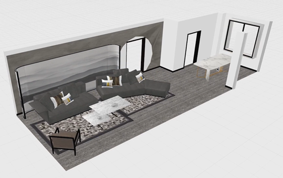

## webgl概述

### 1-webgl是什么？

webgl 是在网页上绘制和渲染三维图形的技术，可以让用户与其进行交互。

我们之前学过的div+css、canvas 2d 都是专注于二维图形的，它们虽然也能模拟一部分三维效果，但它们和webgl 比起来，性能和能力有一定差别。

### 2-webgl行业背景

随着 5G 时代的到来，3D可视化需求大量涌现。3D 游戏，酷炫的活动宣传页，三维数字城市，VR全景展示、3D 产品展示等领域中，很多项目都是用 WebGL 实现的，也只能用WebGL来做，也就是说，WebGL 的时代就在眼前了。

通过一些实际案例，我们可以知道WebGL 能做什么：

- 3D数据可视化：https://cybermap.kaspersky.com/
- 家居卖场：https://showroom.littleworkshop.fr/
- 天猫宣传页：https://shrek.imdevsh.com/show/tmall/
- 汽车模型：https://ezshine.gitee.io/www/showcase/smart3dh5/loader.html
- 趣空间：http://www.3dnest.cn/page/case/case0.html
